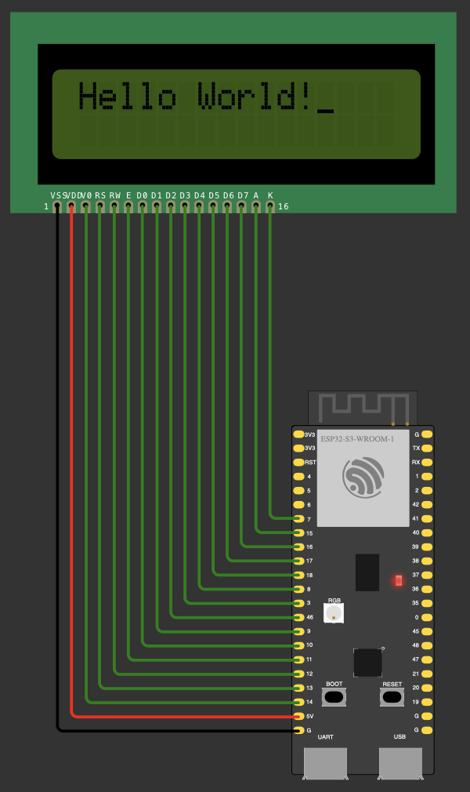

# Drivers for 1602A LCD display (in non-I2C mode)

This repository contains easy to use, abstracted 1602A LCD drivers (16x2 without I2C support).

Currently the driver is available only in C, but there are plans to also implement
it in C++, Python, Rust and Go.

## Usage

The driver aims to be "hardware-agnostic". Meaning, it's not tied to one particular
device, but should be easy to use on pretty much any board. You just need to provide
methods for setting/reading pins and delaying execution with millisecond precision.
Some boards may also require some additional setup before you can use GPIO pins, so
there is also a method for that. But you can leave that one empty if it's not
applicable.

The code below shows how to use the C driver with the ESP32 S3 board.

```c
#include "lcd1602a.h"

int esp32_gpio_setup(LCD1602A_PIN_T pin) {
    gpio_reset_pin(pin);
    gpio_set_direction(pin, GPIO_MODE_OUTPUT);
    return 0;
}

int esp32_gpio_set(LCD1602A_PIN_T pin, LCD1602A_VALUE_T value) {
    return gpio_set_level(pin, value);
}

int esp32_gpio_read(LCD1602A_PIN_T pin, LCD1602A_VALUE_T* value) {
    *value = gpio_get_level(pin);
    return 0;
}

void esp32_delay_ms(int ms) {
    vTaskDelay(ms / portTICK_PERIOD_MS);
}

void app_main() {
  struct lcd1602a_pins pinout = {
    14, 13, 12, 11, 10, 9, 46, 3, 8, 18, 17, 16, 15, 7
  };
  struct lcd1602a_lcd lcd = {
    &esp32_gpio_set, &esp32_gpio_read, &esp32_gpio_setup, &esp32_delay_ms, &pinout
  };

  lcd1602a_init(&lcd);
  lcd1602a_print(&lcd, "Hello World!");
}
```

For reference attaching screenshot from the Wokwi simulator showing how the LCD
has been connected to the board.


## Wokwi Samples

`wokwi_samples` directory contains code samples that you can use to quickly
test out the driver. In order to do that simply navigate to [Wokwi's website](https://wokwi.com) and create a new project. Then simply copy the files, they contain the driver, Wokwi definition and runner code.

## Resources

1602A LCD Datasheet: https://www.openhacks.com/uploadsproductos/eone-1602a1.pdf

